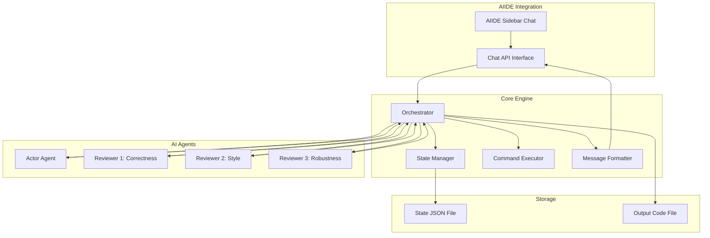

# Design Document

## Overview

本系统实现一个自动化AI开发代理，采用Actor-Reviewer架构模式。系统通过一个Actor代理生成代码，三个专业化的Reviewer代理从不同角度审查代码，形成闭环迭代直到达成共识或达到最大迭代次数。

## Architecture



## Components and Interfaces

### 1. Orchestrator

协调整个开发流程的核心组件。

```python
class Orchestrator:
    def __init__(self, config: Config):
        """初始化编排器"""
        pass
    
    def run_task(self, task: Task) -> TaskResult:
        """执行开发任务的主循环"""
        pass
    
    def _run_iteration(self, state: DevState) -> IterationResult:
        """执行单次迭代"""
        pass
    
    def _aggregate_feedback(self, reviews: List[Review]) -> AggregatedFeedback:
        """聚合所有Reviewer的反馈"""
        pass
    
    def _check_consensus(self, reviews: List[Review]) -> bool:
        """检查是否达成共识"""
        pass
```

### 2. Actor Agent

负责生成和修改代码的代理。

```python
class ActorAgent:
    def __init__(self, model_config: ModelConfig):
        """初始化Actor代理"""
        pass
    
    def generate_code(self, task: Task) -> CodeOutput:
        """根据任务描述生成初始代码"""
        pass
    
    def revise_code(self, code: str, feedback: AggregatedFeedback) -> CodeOutput:
        """根据反馈修改代码"""
        pass
```

### 3. Reviewer Agents

三个专业化的审查代理。

```python
class BaseReviewer:
    def __init__(self, model_config: ModelConfig, focus_area: str):
        """初始化Reviewer"""
        pass
    
    def review(self, code: str, task: Task) -> Review:
        """审查代码并返回反馈"""
        pass

class CorrectnessReviewer(BaseReviewer):
    """专注于代码正确性和逻辑错误"""
    pass

class StyleReviewer(BaseReviewer):
    """专注于代码风格和最佳实践"""
    pass

class RobustnessReviewer(BaseReviewer):
    """专注于边界情况和错误处理"""
    pass
```

### 4. State Manager

管理任务状态的持久化。

```python
class StateManager:
    def __init__(self, state_dir: Path):
        """初始化状态管理器"""
        pass
    
    def save_state(self, state: DevState) -> None:
        """保存当前状态到JSON文件"""
        pass
    
    def load_state(self, task_id: str) -> Optional[DevState]:
        """加载已保存的状态"""
        pass
    
    def list_pending_tasks(self) -> List[str]:
        """列出所有未完成的任务"""
        pass
```

### 5. Command Executor

执行shell命令的组件。

```python
class CommandExecutor:
    def __init__(self, safe_mode: bool = True):
        """初始化命令执行器"""
        pass
    
    def execute(self, command: str) -> CommandResult:
        """执行shell命令"""
        pass
    
    def is_dangerous(self, command: str) -> bool:
        """检查命令是否危险"""
        pass
```

### 6. Kiro Visual Automation Interface

通过视觉自动化与Kiro侧边栏交互的接口。

```python
class KiroVisualInterface:
    def __init__(self, config: VisualConfig):
        """初始化视觉自动化接口"""
        pass
    
    def locate_input_field(self) -> Tuple[int, int]:
        """定位Kiro输入框位置"""
        pass
    
    def type_message(self, message: str) -> None:
        """在输入框中输入消息"""
        pass
    
    def submit_message(self) -> None:
        """提交消息（按Enter或点击发送按钮）"""
        pass
    
    def wait_for_response(self, timeout: int = 60) -> bool:
        """等待Kiro响应完成"""
        pass
    
    def capture_response(self) -> str:
        """捕获并解析Kiro的响应文本"""
        pass
    
    def send_and_receive(self, message: str) -> str:
        """发送消息并等待接收响应的完整流程"""
        pass

class ScreenCapture:
    def capture_region(self, x: int, y: int, width: int, height: int) -> Image:
        """截取屏幕指定区域"""
        pass
    
    def find_element(self, template: Image) -> Optional[Tuple[int, int]]:
        """通过模板匹配查找元素位置"""
        pass
    
    def ocr_region(self, region: Image) -> str:
        """对区域进行OCR文字识别"""
        pass

class InputSimulator:
    def click(self, x: int, y: int) -> None:
        """模拟鼠标点击"""
        pass
    
    def type_text(self, text: str, interval: float = 0.02) -> None:
        """模拟键盘输入文本"""
        pass
    
    def press_key(self, key: str) -> None:
        """模拟按键"""
        pass

@dataclass
class VisualConfig:
    input_field_region: Tuple[int, int, int, int]  # x, y, width, height
    response_region: Tuple[int, int, int, int]
    submit_button_pos: Optional[Tuple[int, int]] = None
    typing_interval: float = 0.02
    response_timeout: int = 120
    check_interval: float = 1.0
```

## Data Models

```python
from dataclasses import dataclass
from typing import List, Optional
from enum import Enum

class ReviewStatus(Enum):
    APPROVED = "approved"
    NEEDS_REVISION = "needs_revision"

@dataclass
class Config:
    model_provider: str  # e.g., "openai", "anthropic"
    model_name: str  # e.g., "gpt-4", "claude-3"
    max_iterations: int = 10
    safe_mode: bool = True
    state_dir: str = ".auto_dev_state"

@dataclass
class Task:
    id: str
    description: str
    context: Optional[str] = None  # 额外上下文，如现有代码

@dataclass
class CodeOutput:
    code: str
    explanation: str
    commands_to_run: List[str]  # 需要执行的命令

@dataclass
class Review:
    reviewer_type: str  # "correctness", "style", "robustness"
    status: ReviewStatus
    issues: List[str]
    suggestions: List[str]
    score: int  # 1-10

@dataclass
class AggregatedFeedback:
    all_approved: bool
    combined_issues: List[str]
    combined_suggestions: List[str]
    priority_items: List[str]  # 最重要的改进项

@dataclass
class IterationResult:
    iteration_number: int
    code: str
    reviews: List[Review]
    consensus_reached: bool

@dataclass
class DevState:
    task: Task
    current_iteration: int
    current_code: str
    iteration_history: List[IterationResult]
    status: str  # "in_progress", "completed", "max_iterations_reached"

@dataclass
class TaskResult:
    success: bool
    final_code: str
    total_iterations: int
    final_reviews: List[Review]
    summary: str

@dataclass
class CommandResult:
    command: str
    success: bool
    stdout: str
    stderr: str
    return_code: int
```


## Correctness Properties

*A property is a characteristic or behavior that should hold true across all valid executions of a system-essentially, a formal statement about what the system should do. Properties serve as the bridge between human-readable specifications and machine-verifiable correctness guarantees.*

### Property 1: Agent Creation Completeness
*For any* task description submitted to the system, the system SHALL create exactly one Actor agent and exactly three Reviewer agents with distinct focus areas.
**Validates: Requirements 1.1**

### Property 2: Code Distribution to All Reviewers
*For any* code generated by the Actor, all three Reviewers SHALL receive the code for evaluation before the iteration completes.
**Validates: Requirements 1.2**

### Property 3: Feedback Aggregation Completeness
*For any* set of three reviews from Reviewers, the aggregated feedback sent to the Actor SHALL contain issues and suggestions from all three reviews.
**Validates: Requirements 1.3**

### Property 4: Consensus Detection Correctness
*For any* set of reviews where all three Reviewers have status APPROVED, the system SHALL mark the task as complete.
**Validates: Requirements 1.4**

### Property 5: Issue-Suggestion Correlation
*For any* review that identifies issues (non-empty issues list), the review SHALL also contain at least one suggestion.
**Validates: Requirements 2.4**

### Property 6: Iteration Continuation Below Maximum
*For any* iteration count below the configured maximum, if consensus is not reached, the system SHALL continue to the next iteration.
**Validates: Requirements 3.2**

### Property 7: Maximum Iteration Termination
*For any* task that reaches maximum iterations without consensus, the output SHALL include the best code version and a summary of remaining issues.
**Validates: Requirements 3.3**

### Property 8: Output Completeness
*For any* iteration, the system output SHALL include the iteration number, code changes, and all Reviewer comments.
**Validates: Requirements 4.1, 4.2, 4.3**

### Property 9: Command Execution Flow
*For any* CodeOutput containing commands_to_run, all commands SHALL be executed and their results captured.
**Validates: Requirements 5.1, 5.2**

### Property 10: Failed Command Error Propagation
*For any* shell command that fails (non-zero return code), the error information SHALL be included in the feedback for the next iteration.
**Validates: Requirements 5.3**

### Property 11: Dangerous Command Safety Check
*For any* command identified as dangerous, the system SHALL not execute it without explicit confirmation.
**Validates: Requirements 5.4**

### Property 12: Configuration Acceptance
*For any* valid model configuration (provider and model name), the system SHALL accept and use the configuration.
**Validates: Requirements 6.1**

### Property 13: Invalid Configuration Fallback
*For any* invalid model configuration, the system SHALL fall back to default configuration and display an error.
**Validates: Requirements 6.3**

### Property 14: State Serialization Round-Trip
*For any* DevState, serializing to JSON and then deserializing SHALL produce an equivalent DevState object.
**Validates: Requirements 7.3, 7.4**

### Property 15: State Persistence After Iteration
*For any* completed iteration, the state file SHALL exist and contain the current state.
**Validates: Requirements 7.1**

### Property 16: State Recovery Detection
*For any* existing state file, the system SHALL detect it on startup and offer to resume.
**Validates: Requirements 7.2**

## Error Handling

### AI API Errors
- 网络超时：重试3次，每次间隔指数增长
- API限流：等待并重试，记录到日志
- 无效响应：记录错误，使用上一次有效响应继续

### Command Execution Errors
- 命令超时：设置默认60秒超时，超时后终止并记录
- 权限错误：记录错误，跳过命令并在反馈中说明
- 命令不存在：记录错误，建议安装依赖

### State Management Errors
- 文件写入失败：重试写入，失败后警告用户
- 文件读取失败：提示用户状态文件损坏，提供重新开始选项
- JSON解析错误：同上

## Testing Strategy

### Unit Testing
使用pytest进行单元测试：
- 测试各组件的独立功能
- 测试数据模型的验证逻辑
- 测试配置解析

### Property-Based Testing
使用Hypothesis库进行属性测试：
- 每个属性测试运行至少100次迭代
- 测试标注格式：`**Feature: auto-dev-agent, Property {number}: {property_text}**`
- 重点测试：
  - 状态序列化/反序列化的round-trip
  - 共识检测逻辑
  - 反馈聚合逻辑
  - 迭代控制逻辑

### Integration Testing
- 测试完整的Actor-Reviewer循环
- 测试命令执行集成
- 测试状态恢复流程
