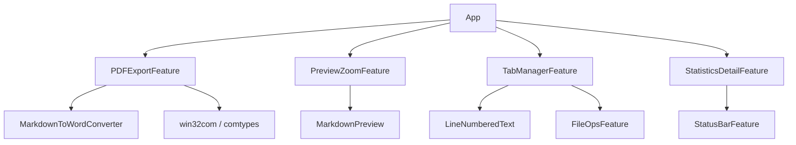

# Design Document: Enhanced Features

## Overview

本设计文档描述了 MarkdowntoWord 应用程序四项增强功能的技术实现方案：
1. **PDF 导出功能** - 通过 Word 中转实现 PDF 导出
2. **预览区缩放功能** - 在预览面板添加缩放控件
3. **多标签页编辑** - 实现标签页式多文档编辑
4. **字数统计详情** - 增强状态栏统计信息

每个功能将作为独立的 Feature 类实现，放置在 `ui/features/` 目录下，遵循现有代码架构风格。

## Architecture

```
ui/features/
├── pdf_export.py          # PDF 导出功能
├── preview_zoom.py        # 预览区缩放功能
├── tab_manager.py         # 多标签页管理
├── statistics_detail.py   # 字数统计详情
└── __init__.py            # 更新导出
```

### 依赖关系



## Components and Interfaces

### 1. PDFExportFeature (pdf_export.py)

```python
class PDFExportFeature:
    def __init__(self, app):
        self.app = app
    
    def export_to_pdf(self) -> None:
        """导出当前内容为 PDF"""
        pass
    
    def _convert_docx_to_pdf(self, docx_path: str, pdf_path: str) -> bool:
        """使用 Word COM 将 docx 转换为 PDF"""
        pass
    
    def _show_export_dialog(self) -> Optional[str]:
        """显示保存对话框，返回用户选择的路径"""
        pass
```

**实现策略**: 由于项目已依赖 `pywin32`，采用 Word COM 接口将 docx 转换为 PDF。流程：
1. 先使用现有 `MarkdownToWordConverter` 生成临时 docx
2. 使用 `win32com.client` 打开 Word 并另存为 PDF
3. 删除临时 docx 文件

### 2. PreviewZoomFeature (preview_zoom.py)

```python
class PreviewZoomFeature:
    def __init__(self, app):
        self.app = app
        self._scale = 1.0
        self._min_scale = 0.5
        self._max_scale = 1.5
        self._step = 0.1
    
    def create_controls(self, parent) -> ctk.CTkFrame:
        """创建缩放控件框架"""
        pass
    
    def zoom_in(self) -> None:
        """放大 10%"""
        pass
    
    def zoom_out(self) -> None:
        """缩小 10%"""
        pass
    
    def reset_zoom(self) -> None:
        """重置为 100%"""
        pass
    
    def _apply_scale(self) -> None:
        """应用缩放到预览区"""
        pass
    
    def save_scale(self) -> None:
        """保存缩放比例到配置"""
        pass
    
    def restore_scale(self) -> None:
        """从配置恢复缩放比例"""
        pass
```

**实现策略**: 利用 `MarkdownPreview` 已有的 `set_scale()` 方法，添加 UI 控件调用它。

### 3. TabManagerFeature (tab_manager.py)

```python
@dataclass
class TabData:
    """标签页数据"""
    id: str
    title: str
    file_path: Optional[str]
    content: str
    modified: bool
    cursor_position: str

class TabManagerFeature:
    def __init__(self, app):
        self.app = app
        self.tabs: List[TabData] = []
        self.active_tab_id: Optional[str] = None
        self.tab_bar: Optional[ctk.CTkFrame] = None
    
    def create_tab_bar(self, parent) -> ctk.CTkFrame:
        """创建标签栏"""
        pass
    
    def new_tab(self, file_path: Optional[str] = None) -> str:
        """创建新标签页，返回 tab_id"""
        pass
    
    def close_tab(self, tab_id: str) -> bool:
        """关闭标签页，返回是否成功"""
        pass
    
    def switch_tab(self, tab_id: str) -> None:
        """切换到指定标签页"""
        pass
    
    def update_tab_title(self, tab_id: str, title: str, modified: bool) -> None:
        """更新标签页标题"""
        pass
    
    def get_active_tab(self) -> Optional[TabData]:
        """获取当前活动标签页"""
        pass
    
    def save_tab_content(self, tab_id: str, content: str) -> None:
        """保存标签页内容"""
        pass
    
    def _create_tab_button(self, tab_data: TabData) -> ctk.CTkFrame:
        """创建单个标签按钮"""
        pass
    
    def _show_context_menu(self, event, tab_id: str) -> None:
        """显示标签页右键菜单"""
        pass
```

**实现策略**: 
- 使用 `CTkFrame` 构建标签栏，每个标签是一个可点击的框架
- 标签数据存储在内存中，切换时保存/恢复编辑器内容
- 与 `FileOpsFeature` 集成处理文件操作

### 4. StatisticsDetailFeature (statistics_detail.py)

```python
@dataclass
class DocumentStatistics:
    """文档统计数据"""
    total_chars: int
    chars_no_spaces: int
    chinese_chars: int
    english_words: int
    paragraphs: int
    lines: int
    reading_time_minutes: float

class StatisticsDetailFeature:
    def __init__(self, app):
        self.app = app
        self._stats: Optional[DocumentStatistics] = None
    
    def calculate_statistics(self, content: str) -> DocumentStatistics:
        """计算文档统计信息"""
        pass
    
    def update_status_bar(self, stats: DocumentStatistics) -> None:
        """更新状态栏显示"""
        pass
    
    def show_detail_popup(self) -> None:
        """显示详细统计弹窗"""
        pass
    
    def _count_chinese_chars(self, text: str) -> int:
        """统计中文字符数"""
        pass
    
    def _count_english_words(self, text: str) -> int:
        """统计英文单词数"""
        pass
    
    def _calculate_reading_time(self, chinese_chars: int, english_words: int) -> float:
        """计算预计阅读时间（分钟）"""
        pass
```

**实现策略**:
- 使用正则表达式区分中英文字符
- 阅读时间计算：中文 300 字/分钟，英文 200 词/分钟
- 点击状态栏统计区域弹出详细信息窗口

## Data Models

### TabData

```python
@dataclass
class TabData:
    id: str                      # 唯一标识符 (UUID)
    title: str                   # 显示标题
    file_path: Optional[str]     # 文件路径，None 表示未保存
    content: str                 # 编辑器内容
    modified: bool               # 是否有未保存修改
    cursor_position: str         # 光标位置 "line.column"
    scroll_position: float       # 滚动位置 0.0-1.0
```

### DocumentStatistics

```python
@dataclass
class DocumentStatistics:
    total_chars: int             # 总字符数
    chars_no_spaces: int         # 不含空格字符数
    chinese_chars: int           # 中文字符数
    english_words: int           # 英文单词数
    paragraphs: int              # 段落数
    lines: int                   # 行数
    reading_time_minutes: float  # 预计阅读时间（分钟）
```

### 配置扩展

在 `ui/theme.py` 的 `DEFAULT_CONFIG` 中添加：

```python
DEFAULT_CONFIG = {
    # ... 现有配置 ...
    'preview_zoom_scale': 1.0,   # 预览缩放比例
    'open_tabs': [],             # 打开的标签页列表
    'active_tab_id': None,       # 当前活动标签页
}
```

## Correctness Properties

*A property is a characteristic or behavior that should hold true across all valid executions of a system-essentially, a formal statement about what the system should do. Properties serve as the bridge between human-readable specifications and machine-verifiable correctness guarantees.*

### Property 1: PDF export produces valid file
*For any* valid Markdown content, exporting to PDF should produce a file that exists at the specified path and has non-zero size.
**Validates: Requirements 1.2**

### Property 2: PDF export preserves page size
*For any* page size setting (A4 or Letter), the exported PDF should have dimensions matching that page size.
**Validates: Requirements 1.6**

### Property 3: Zoom in increases scale correctly
*For any* current scale value below maximum (1.5), clicking zoom in should increase the scale by exactly 0.1.
**Validates: Requirements 2.2**

### Property 4: Zoom out decreases scale correctly
*For any* current scale value above minimum (0.5), clicking zoom out should decrease the scale by exactly 0.1.
**Validates: Requirements 2.3**

### Property 5: Zoom scale persistence round-trip
*For any* zoom scale value, saving and then restoring should produce the same scale value.
**Validates: Requirements 2.6**

### Property 6: Tab creation for opened files
*For any* file that is opened, a new tab should be created with the file's name as title.
**Validates: Requirements 3.2**

### Property 7: Tab switch displays correct content
*For any* tab switch operation, the editor content should match the stored content of the target tab.
**Validates: Requirements 3.3**

### Property 8: Modified indicator accuracy
*For any* tab where content differs from last saved state, the tab title should include an asterisk.
**Validates: Requirements 3.5**

### Property 9: Character count accuracy
*For any* text input, the character count should equal the length of the text string.
**Validates: Requirements 4.1**

### Property 10: Word count accuracy
*For any* text input, the word count should equal the number of whitespace-separated tokens.
**Validates: Requirements 4.2**

### Property 11: Paragraph count accuracy
*For any* text input, the paragraph count should equal the number of non-empty text blocks separated by blank lines.
**Validates: Requirements 4.3**

### Property 12: Reading time calculation
*For any* text with known Chinese character count and English word count, reading time should equal (chinese_chars / 300 + english_words / 200) minutes.
**Validates: Requirements 4.4, 4.8**

## Error Handling

### PDF Export Errors

| Error Type | Handling Strategy |
|------------|-------------------|
| Word not installed | 显示错误提示，建议安装 Microsoft Word |
| Permission denied | 提示用户检查文件是否被占用或路径权限 |
| Conversion failed | 显示详细错误信息，保留临时 docx 供调试 |
| Disk full | 提示磁盘空间不足 |

### Tab Manager Errors

| Error Type | Handling Strategy |
|------------|-------------------|
| File read error | 显示错误提示，不创建标签页 |
| Memory limit | 限制最大标签页数量（建议 20 个） |
| State corruption | 重置为单个空白标签页 |

## Testing Strategy

### Unit Testing

使用 `pytest` 进行单元测试：

1. **StatisticsDetailFeature 测试**
   - 测试中文字符计数
   - 测试英文单词计数
   - 测试阅读时间计算
   - 测试空文本处理

2. **PreviewZoomFeature 测试**
   - 测试缩放边界值
   - 测试缩放步进精度

3. **TabManagerFeature 测试**
   - 测试标签创建/删除
   - 测试内容切换

### Property-Based Testing

使用 `hypothesis` 库进行属性测试：

1. **统计计算属性测试**
   - 生成随机文本，验证统计结果一致性
   - 验证阅读时间计算公式

2. **缩放属性测试**
   - 生成随机缩放操作序列，验证边界约束

3. **标签页属性测试**
   - 生成随机标签操作，验证状态一致性

### Integration Testing

1. **PDF 导出集成测试**
   - 测试完整导出流程
   - 验证生成的 PDF 可打开

2. **多标签页集成测试**
   - 测试文件打开/保存与标签页的交互
   - 测试应用重启后标签页恢复
